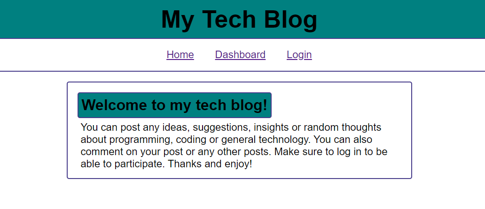

# Blog

## Overview
This assignment asked us to create a tech blog that allows users to make posts and comment on posts after they've signed up and logged in. This requires using several npm packages: express, express-session, MySQL2, Sequelize, connect-session-sequelize, handlebars.js, dotenv and bcrypt. Once completed the application was launched as a live site using Heroku.

## Application Link
[My Tech Blog Link](https://thawing-wave-32107.herokuapp.com/)

## Preview
